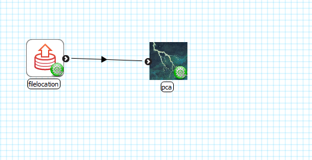
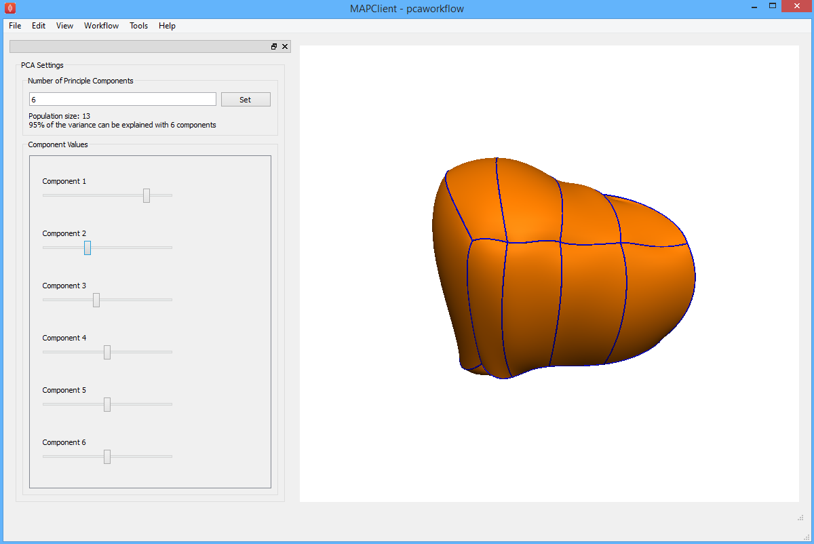

zincPCA
=======

The zincPCA step is a plugin for the MAP Client application. Given a set of geometries, this plugin helps you to visualise how each principle-component changes the geometry. 

Requirements
=======
* numpy

Setup
=======
* Add a *Directory Chooser* step, and configure the directory to the location of the geometries. *Note: use full file path.*
* Then add a *zincPCA* step

Preview
-------
You can specify the number of principle-components, pressing the **Set** button will establish the new setting. 
Changing the sliders will modify the geometry.

Example
-------

As an example you can use the two sets of 15 liver geometries provided.

* Two-element cubic-hermite liver:  ./example_geometries/twocubes 
* Four-element cubic-hermite liver:  ./example_geometries/fourcubes 

TODO
------
* Add embedding geometry
* Make new step icon
